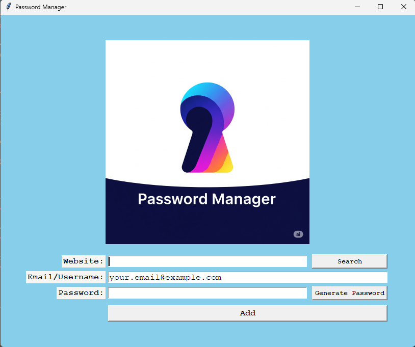
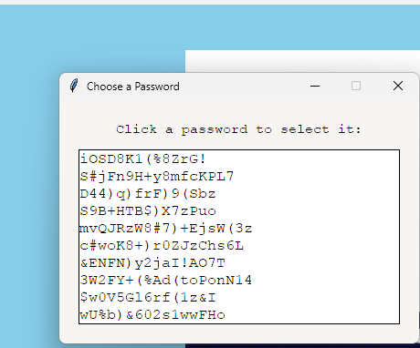

# 🔑 Python Password Manager

A simple and secure desktop application built with Python's Tkinter, designed to help you generate strong passwords and securely manage your website credentials. Never forget a password again!

## ✨ Features

- **Strong Password Generation:** Generate complex, random passwords with a mix of letters, numbers, and symbols.
- **Password Selector:** Choose from a list of generated strong passwords with a single click.
- **Secure Data Storage:** Saves your website, email, and password details locally in a structured JSON file.
- **Search Functionality:** Quickly retrieve saved credentials for any website.
- **User-Friendly Interface:** Intuitive graphical user interface powered by Tkinter.
- **Error Handling:** Robust error handling to prevent crashes from invalid input or missing data.

## 📸 Screenshots / Demo





## 🚀 How to Run

Follow these steps to get the Password Manager up and running on your local machine.

### Prerequisites

- Python 3.x installed on your system.

### Installation

1.  **Clone the repository:**

    ```bash
    git clone [https://github.com/YourGitHubUsername/PasswordManager.git](https://github.com/YourGitHubUsername/PasswordManager.git)
    cd PasswordManager
    ```

    _(Replace `YourGitHubUsername` and `PasswordManager` with your actual repository details.)_

2.  **Install dependencies:**
    This project primarily uses Python's standard library modules. If there were external dependencies, they would be listed in `requirements.txt`. For now, simply ensuring Python 3 is installed should be sufficient.
    _(If you add any external libraries in the future, uncomment and use this command:)_
    ```bash
    # pip install -r requirements.txt
    ```

### Running the Application

1.  Navigate to the project directory if you haven't already:
    ```bash
    cd PasswordManager
    ```
2.  Run the main application script:
    ```bash
    python main.py
    ```

## 📝 Usage

1.  **Add New Credentials:**
    - Enter the **Website**, your **Email/Username**, and your **Password** in the respective fields.
    - Click "Generate Password" to get a strong, random password. A popup will allow you to select from multiple options.
    - Click "Add" to save the credentials. The application will ask for confirmation and then store the data securely.
2.  **Search for Credentials:**
    - Enter the **Website** name in the Website field.
    - Click "Search". If found, a popup will display your saved Email/Username and Password for that website.
3.  **Data Storage:**
    - Your credentials are saved in a `data.json` file in the same directory as the application. **This file is kept local to your machine and is not committed to the Git repository for security reasons.**

## ⚠️ Security Note

The passwords are stored in a local JSON file without encryption in this basic version. **This project is for educational purposes to demonstrate Python GUI and file handling.** For real-world sensitive password management, consider using robust encryption methods or dedicated password manager software. **Never share your `data.json` file!**

## 🤝 Contributing

Contributions are welcome! If you have suggestions for improvements or bug fixes, please feel free to open an issue or submit a pull request.

## 📄 License

This project is licensed under the MIT License - see the `LICENSE` file for details.

---
